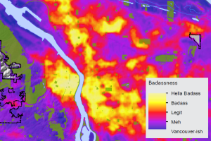

<div style="display:table-row">
<div style="display: table-cell; width=370px" markdown="1">

### Project 1 



Other details

</div>

<div style="display: table-cell; width=370px" markdown="1">

### Project 2


Some more details

_Even more details here._

*Sources*: 
[Supportland](https://supportland.com/), [Oregon Craft Brew Guild](https://oregoncraftbeer.org/guild/)

</div>
</div>

### Markdown

Markdown is a lightweight and easy-to-use syntax for styling your writing. It includes conventions for

```markdown
Syntax highlighted code block

# Header 1
## Header 2
### Header 3

- Bulleted
- List

1. Numbered
2. List

**Bold** and _Italic_ and `Code` text

[Link](url) and 
```

For more details see [GitHub Flavored Markdown](https://guides.github.com/features/mastering-markdown/).

### Jekyll Themes

Your Pages site will use the layout and styles from the Jekyll theme you have selected in your [repository settings](https://github.com/dillonma/dillonma.github.io/settings). The name of this theme is saved in the Jekyll `_config.yml` configuration file.

### Support or Contact

Having trouble with Pages? Check out our [documentation](https://help.github.com/categories/github-pages-basics/) or [contact support](https://github.com/contact) and we’ll help you sort it out.
